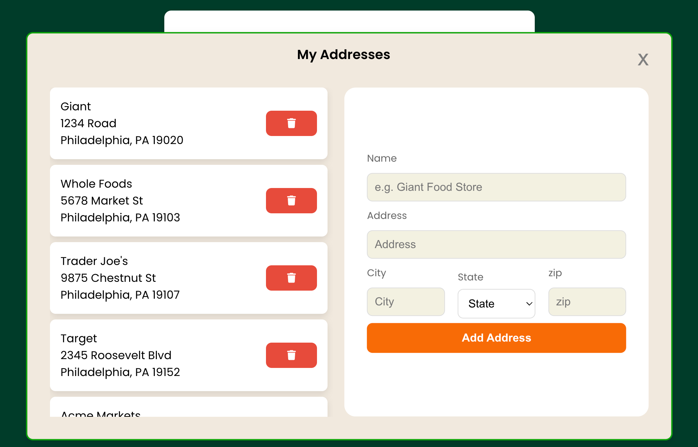

# Instacart Shopper Wage Calculator

---

### Overview

This repository contains a full-stack web application with a **FastAPI** backend and a **React** frontend. The backend is managed using **Poetry** for Python dependency management, and the frontend is built with **React**.

### Purpose

This tool helps **Instacart shoppers** estimate their pay for orders before accepting them. By entering order details like distance, items, and delivery time, shoppers can make more informed decisions about which orders to accept.


### Prerequisites

Before running the project, ensure you have the following installed:

- [Python 3.8+](https://www.python.org/downloads/)
- [Poetry](https://python-poetry.org/docs/#installation) (for Python dependency management)
- [Node.js](https://nodejs.org/en/download/) (for the React frontend)
- [npm](https://www.npmjs.com/get-npm) (or [yarn](https://yarnpkg.com/) for React)

### Project Structure

- **`/backend`**: Contains the FastAPI backend and its API routes.
- **`/frontend`**: Contains the React frontend with UI components.
- **`README.md`**: This file.

# Setup and Installation

---

### 1. Clone the repository

```bash
git clone https://github.com/rachelmalbert/shopper.git
cd shopper
```

### 2. Set up the backend (FastAPI with Poetry)

1. Navigate to the backend folder:

   ```bash
   cd backend
   ```

2. Install the backend dependencies using Poetry:

   ```bash
   poetry install
   ```

3. Activate the Poetry virtual environment:

   ```bash
   poetry shell
   ```

4. Start the FastAPI server:

   ```bash
   poetry run uvicorn app.main:app --reload
   ```

   This will run the backend at `http://127.0.0.1:8000`.

### 3. Set up the frontend (React)

1. Navigate to the frontend folder:

   ```bash
   cd ../frontend
   ```

2. Install the frontend dependencies:

   ```bash
   npm install
   ```

3. Start the React development server:

   ```bash
   npm start
   ```

   This will run the frontend at `http://127.0.0.1:3000`.

# Usage

---

### 1. Creating an Account

To start using the application, you'll need to create an account. Follow these steps:

1. Open the app in your browser at `http://localhost:3000`.
2. Click on the **Sign Up** link located at the bottom of the sign in form.
3. Fill in the required details such as your **Username** and **Password**.
4. Click the **Create Account** button.
5. You will be redirected to the main page upon successful sign up.

### 2. Using the Wage Estimator

The calculator allows you to perform basic arithmetic operations. Here’s how to use it:

1. **Adding Store Addresses**:
   - Add your frequently shopped stores by clicking on **Add Store** below the Store dropdown list.
   - Fill out store information and click **Add Address** when finished.
   - Delete unwanted stores by clicking the red trashcan icon to the right of the store you wish to delete.
   - 
2. **Calculating Estimated Hourly Pay for an Order**:
   - Fill out all information needed to estimate hourly pay for an order (store, batch pay, distance (miles), number of items, seconds per item (found in the Instacart shopper application).
   - Click the orange calculate button.

### 3. Signing Out

To sign out of your account and secure your session:

1. Click the **Sign Out** button in the bottom left corner of the main page.
2. You will be logged out and redirected to the homepage, where you can either sign in again or sign up for a new account.

That's it! You're all set to use the application. Enjoy!
